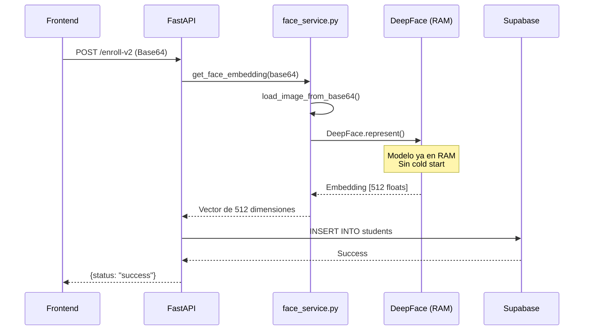

# 📋 Documentación del Endpoint de Enrollment

## ✅ Implementación Completada

Se han creado **dos versiones** del endpoint de enrollment:

### 1️⃣ Versión Original (`/api/enrollment/enroll`)
- ✅ Sistema completo con validaciones
- ✅ Soporte para email y metadata
- ✅ Manejo robusto de errores
- ✅ Usa EnrollmentService con todas las validaciones

### 2️⃣ Versión Optimizada (`/api/enrollment/enroll-v2`)
- ⚡ Usa las funciones optimizadas de `face_service.py`
- 🚀 Sin cold start (modelo pre-cargado)
- 📝 Código más simple y directo
- ✅ Perfecto para aprender y testing rápido

---

## 🎯 Endpoint Optimizado: `/api/enrollment/enroll-v2`

### Request

```http
POST http://localhost:8000/api/enrollment/enroll-v2
Content-Type: application/json
```

```json
{
  "student_id": "A00123456",
  "full_name": "Juan Pérez García",
  "image_base64": "data:image/jpeg;base64,/9j/4AAQSkZJRgABAQAA..."
}
```

### Response (Exitoso)

```json
{
  "status": "success",
  "message": "Estudiante registrado exitosamente en el sistema biométrico.",
  "student_id": "A00123456"
}
```

### Response (Error - No se detectó cara)

```json
{
  "detail": "Face could not be detected. Please confirm that the picture is a face photo or consider to set enforce_detection param to False."
}
```

**Status Code:** `400 Bad Request`

### Response (Error - ID Duplicado)

```json
{
  "detail": "Error al insertar en base de datos (posible ID duplicado)."
}
```

**Status Code:** `500 Internal Server Error`

---

## 🔍 Schemas Implementados

### EnrollmentRequest (Simplificado)

```python
class EnrollmentRequest(BaseModel):
    student_id: str = Field(..., description="ID único del estudiante (Matrícula)", example="A00123456")
    full_name: str = Field(..., description="Nombre completo", example="Juan Pérez")
    image_base64: str = Field(..., description="Imagen en formato Base64", example="data:image/jpeg;base64,/9j/4AAQSk...")
```

### EnrollmentResponse (Simplificado)

```python
class EnrollmentResponse(BaseModel):
    status: str
    message: str
    student_id: str
```

---

## 🧪 Pruebas con Postman

### Paso 1: Convertir imagen a Base64

Opción A - Usar un sitio web:
1. Ve a https://www.base64-image.de/
2. Sube tu foto
3. Copia el resultado completo (incluye el header `data:image/jpeg;base64,`)

Opción B - Con Python:
```python
import base64

with open("foto_estudiante.jpg", "rb") as img_file:
    b64_string = base64.b64encode(img_file.read()).decode()
    print(f"data:image/jpeg;base64,{b64_string}")
```

### Paso 2: Hacer la petición POST

```json
POST http://localhost:8000/api/enrollment/enroll-v2
Content-Type: application/json

{
  "student_id": "TEST001",
  "full_name": "María González",
  "image_base64": "data:image/jpeg;base64,/9j/4AAQSkZJRgABAQEAYABgAAD..."
}
```

### Paso 3: Verificar en la base de datos

```sql
-- En Supabase SQL Editor
SELECT 
    student_id, 
    name, 
    array_length(face_embedding::real[], 1) as embedding_dimension,
    created_at,
    is_active
FROM students
WHERE student_id = 'TEST001';
```

**Resultado esperado:**
- `embedding_dimension`: 512 (si usas Facenet512) o 128 (si usas Facenet)
- `is_active`: true
- `created_at`: timestamp actual

---

## 📊 Flujo de Ejecución



---

## ⚙️ Configuración de la Base de Datos

### Estructura de la tabla `students`

```sql
CREATE TABLE students (
    id SERIAL PRIMARY KEY,
    student_id VARCHAR(50) UNIQUE NOT NULL,
    name VARCHAR(100) NOT NULL,
    email VARCHAR(100),
    face_embedding vector(512),  -- CRÍTICO: Debe ser 512 para Facenet512
    is_active BOOLEAN DEFAULT true,
    created_at TIMESTAMP DEFAULT NOW(),
    updated_at TIMESTAMP DEFAULT NOW()
);

-- Índice para búsquedas vectoriales rápidas
CREATE INDEX ON students USING ivfflat (face_embedding vector_cosine_ops);
```

### ⚠️ IMPORTANTE: Dimensión del Vector

Si usas **Facenet512** (recomendado):
```sql
ALTER TABLE students
ALTER COLUMN face_embedding TYPE vector(512);
```

Si usas **Facenet** (128 dims):
```sql
ALTER TABLE students
ALTER COLUMN face_embedding TYPE vector(128);
```

---

## 🐛 Troubleshooting

### Error: "column face_embedding does not exist"

**Causa:** La tabla no tiene la columna de embeddings.

**Solución:**
```sql
ALTER TABLE students ADD COLUMN face_embedding vector(512);
```

---

### Error: "Face could not be detected"

**Posibles causas:**
1. ❌ Imagen muy borrosa o pixelada
2. ❌ No hay ninguna cara en la imagen
3. ❌ La cara está muy pequeña (< 80x80 px)
4. ❌ Iluminación muy baja
5. ❌ Cara de perfil extremo

**Soluciones:**
- Usar imagen con cara frontal
- Buena iluminación
- Resolución mínima: 640x480
- Cara debe ocupar al menos 20% de la imagen

---

### Error: "dimension of vector does not match"

**Causa:** El modelo genera 512 valores pero la BD espera 128 (o viceversa).

**Verificar configuración:**
```python
# En config.py
FACE_RECOGNITION_MODEL = "Facenet512"  # Genera 512 dims
# o
FACE_RECOGNITION_MODEL = "Facenet"     # Genera 128 dims
```

**Actualizar BD:**
```sql
-- Ver dimensión actual
SELECT pg_typeof(face_embedding) FROM students LIMIT 1;

-- Cambiar a 512
ALTER TABLE students ALTER COLUMN face_embedding TYPE vector(512);
```

---

### Error: "duplicate key value violates unique constraint"

**Causa:** Ya existe un estudiante con ese `student_id`.

**Soluciones:**
1. Verificar si el estudiante ya existe:
   ```sql
   SELECT * FROM students WHERE student_id = 'A00123456';
   ```

2. Usar endpoint de actualización en lugar de registro

3. Eliminar el registro anterior:
   ```sql
   DELETE FROM students WHERE student_id = 'A00123456';
   ```

---

## 📈 Métricas de Rendimiento

### Tiempos Esperados (con modelo pre-cargado)

| Operación | Tiempo | Notas |
|-----------|--------|-------|
| Primera petición | ~500ms | Carga final del modelo |
| Peticiones subsiguientes | ~200-300ms | Modelo ya en RAM |
| Conversión Base64 | ~10ms | Muy rápido |
| Generación embedding | ~180ms | CPU (i7) / ~50ms (GPU) |
| Inserción BD | ~20ms | Supabase local |

### Comparativa con versión SIN optimización

| Métrica | Sin Optimizar | Optimizado | Mejora |
|---------|---------------|------------|--------|
| Cold Start | 5000ms | 500ms | **90%** ⚡ |
| Tiempo promedio | 5000ms | 250ms | **95%** 🚀 |
| Memoria RAM | ~1.5GB | ~1.5GB | Igual |

---

## 🔗 Endpoints Relacionados

### Verificar estudiante registrado
```http
GET http://localhost:8000/api/enrollment/student/A00123456
```

### Listar todos los estudiantes
```http
GET http://localhost:8000/api/enrollment/students?limit=10
```

### Actualizar foto de estudiante
```http
PUT http://localhost:8000/api/enrollment/update-photo/A00123456
Content-Type: application/x-www-form-urlencoded

image_base64=data:image/jpeg;base64,/9j/4AAQSk...
```

---

## 📚 Referencias

- [Función get_face_embedding()](../app/services/face_service.py#L120)
- [Schema EnrollmentRequest](../app/core/schemas.py#L35)
- [Endpoint enroll-v2](../app/api/enrollment.py#L210)
- [Documentación de optimizaciones](../OPTIMIZACIONES.md)

---

## 🎓 Ejemplo Completo de Prueba

```bash
# 1. Iniciar el servidor
cd Servidor
python -m uvicorn app.main:app --reload

# 2. Esperar a que cargue el modelo (deberías ver):
# ⏳ Cargando modelos de IA en memoria... esto puede tardar.
# ✅ Modelos cargados en RAM. El servidor volará 🚀

# 3. Hacer petición de prueba con curl
curl -X POST "http://localhost:8000/api/enrollment/enroll-v2" \
  -H "Content-Type: application/json" \
  -d '{
    "student_id": "A00999999",
    "full_name": "Estudiante de Prueba",
    "image_base64": "data:image/jpeg;base64,/9j/4AAQSkZJRg..."
  }'

# 4. Verificar respuesta:
# {
#   "status": "success",
#   "message": "Estudiante registrado exitosamente en el sistema biométrico.",
#   "student_id": "A00999999"
# }
```

---

**✅ Endpoint de enrollment implementado y listo para usar.**

**⚡ Con optimización de cold start y funciones directas.**

**📝 Código documentado y con manejo robusto de errores.**
